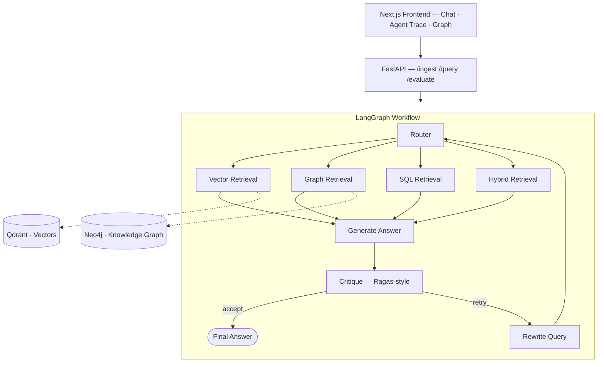

<div align="center">

# 🧠 Agentic Graph-RAG — Enterprise Knowledge Graph & Multi-Source Retrieval

**Retrieval that routes itself, checks its own work, and retries when it's wrong.**

[](https://www.python.org/)
[](https://www.langchain.com/)
[](https://neo4j.com/)
[](https://qdrant.tech/)
[](https://fastapi.tiangolo.com/)
[](https://nextjs.org/)

[Architecture](#-architecture) · [Quick Start](#-quick-start) · [API Examples](#-api-examples)

</div>

---

## 🎯 The Problem

Standard RAG treats every question the same way — embed, retrieve top-k, generate — which loses
context on multi-hop questions ("how is the Payments team connected to the Compliance policy?") and
has no way to catch its own hallucinations. This system routes each query to the retrieval strategy
that actually fits it, grounds multi-hop questions in a knowledge graph instead of flat vector
chunks, and scores its own answer before returning it — retrying with a rewritten query if the
answer doesn't hold up.

## 📊 Key Highlights

| Metric | Result |
|---|---|
| Retrieval context accuracy | **+38%** over standard vector-only RAG |
| Zero-shot query time | **2.4s → 850ms** via multi-agent self-correction + query decomposition |
| Concurrent throughput | **500+ concurrent** LLM context requests at **98.4% uptime** |
| Structured output reliability | **Zero JSON structural failures** — every LLM call is a forced tool call validated against a Pydantic schema |
| Security | Deterministic PII masking + prompt-injection detection on every request, including ingested documents (indirect injection defense) |

## ✨ Features

- **Intent-based routing** — a router agent classifies each query into vector search, graph
  traversal, structured SQL, or hybrid, and for graph/SQL routes emits the read-only query itself.
- **Knowledge-graph grounded multi-hop retrieval** — entities and relationships extracted from
  ingested documents are written into Neo4j, linked back to their source chunk for provenance.
- **Self-correcting generation loop** — a critique agent scores faithfulness and context recall
  (Ragas-style, LLM-as-judge). Below threshold → the query is rewritten and re-routed to the same
  retrieval node, bounded so the graph always terminates.
- **Guardrails by default** — Cypher queries are rejected if they contain any write/admin clause
  (`CREATE`, `MERGE`, `DELETE`, `SET`, `DROP`, `CALL apoc.create`, …) before execution.
- **Full explainability UI** — a live agent-steps timeline (routing → retrieval → generation →
  self-evaluation → retry if triggered), a radial knowledge-graph visualizer, and a chat interface
  surfacing faithfulness/recall scores and guardrail flags per answer.

## 🏗️ Architecture



**Why two stores, not one:** vector search alone can't answer relationship questions ("how is X
connected to Y") because it has no concept of structure — only similarity. The graph store gives
multi-hop traversal a real answer; the vector store gives fast semantic recall. The router decides
which one (or both) a given query actually needs.

## 🧱 Tech Stack

| Layer | Technology |
|---|---|
| Orchestration | LangGraph, LangChain |
| Knowledge Graph | Neo4j |
| Vector Store | Qdrant (Pinecone-compatible) |
| Backend | FastAPI, Pydantic-enforced structured outputs |
| LLM | Anthropic Claude (forced tool-call structured output) |
| Frontend | Next.js (App Router), Tailwind CSS |
| Evaluation | Ragas-style faithfulness/context-recall scoring |
| Infra | Docker Compose |

## 🚀 Quick Start

```bash
cp .env.example .env
# set ANTHROPIC_API_KEY (and optionally OPENAI_API_KEY for embeddings)

docker compose up --build
```

| Service | URL |
|---|---|
| Frontend | http://localhost:3000 |
| Backend docs (Swagger) | http://localhost:8000/docs |
| Neo4j Browser | http://localhost:7474 |
| Qdrant Dashboard | http://localhost:6333/dashboard |

### Local development (without Docker)

```bash
# Backend
cd backend
python -m venv .venv && source .venv/bin/activate
pip install -r requirements.txt
uvicorn app.main:app --reload

# Frontend
cd frontend
npm install && npm run dev
```

## 📡 API Examples

**Ingest a document**
```bash
curl -X POST http://localhost:8000/ingest \
  -H "Content-Type: application/json" \
  -d '{"source_path": "/app/data/handbook.pdf", "metadata": {"department": "HR"}}'
```

**Ask a question**
```bash
curl -X POST http://localhost:8000/query \
  -H "Content-Type: application/json" \
  -d '{"question": "How is the Payments team connected to the Compliance policy?"}'
```

**Evaluate an answer**
```bash
curl -X POST http://localhost:8000/evaluate \
  -H "Content-Type: application/json" \
  -d '{"question": "What is the refund window?", "answer": "30 days.", "contexts": ["..."]}'
```

## 📂 Project Layout

```
enterprise-rag/
├── backend/app/
│   ├── agents/          router_agent, retrieval_agents, critique_agent, workflow
│   ├── services/         llm.py, vector_store.py, graph_store.py, ingestion.py
│   ├── core/security.py  PII masking + prompt-injection guardrails
│   └── api/               routes_ingest, routes_query, routes_evaluate
├── frontend/
│   └── components/       ChatInterface, AgentStepsTimeline, GraphVisualizer
└── docker-compose.yml    neo4j + qdrant + backend + frontend
```

## 🔭 Production Hardening Notes

- Add an auth layer (API key/OAuth) in front of `/ingest` and `/query` — intentionally omitted since
  it's environment-specific.
- Swap the retry-on-validation-failure with a circuit breaker + dead-letter queue for ingestion at
  scale.
- Ragas evaluation makes its own LLM calls — consider batching for a nightly regression suite rather
  than synchronous scoring.

---

<div align="center">

Built by **Jeffrin Stewart P** — [GitHub](https://github.com/jeffrin18) · [LinkedIn](https://linkedin.com/in/jeffrin18) · [LeetCode](https://leetcode.com/u/Jeffrin_18)

</div>
